# Respiri API and Client by Timothy Lopez

## Table of Contents

1. [Prerequisites](#prerequisites)
2. [Installation](#installation)
3. [Running the API Server](#running-the-api-server)
4. [Running the API Client](#running-the-api-client)
5. [Features](#features)
6. [Contact](#contact)

## Prerequisites

Before you begin, ensure you have met the following requirements:

- **.NET 6 SDK**: You will need the .NET 6 SDK installed on your machine to build and run the Respiri API and Client. You can download and install it from [https://dotnet.microsoft.com/download/dotnet/6.0](https://dotnet.microsoft.com/download/dotnet/6.0).

- **Visual Studio 2022 (Recommended)**: For the simplicity of installation and a seamless development experience, it is recommend to use Visual Studio 2022. It provides a full-featured development environment for .NET projects. You can download Visual Studio 2022 from [https://visualstudio.microsoft.com/downloads/](https://visualstudio.microsoft.com/downloads/).

## Installation

To install and run the Respiri API and Client, follow the steps below:

### Running the API Server

1. Open the `persons-api.sln` solution file located in the `Respiri\src\api\Persons-api` directory.

2. Build and run the solution.

    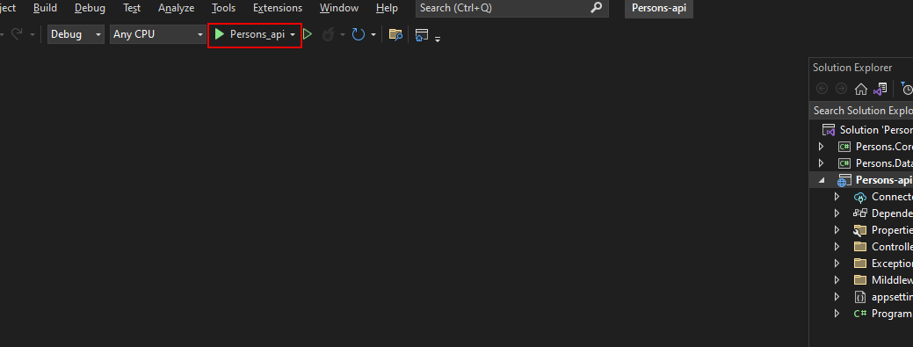

3. API Portal will open in browser. Take note of the base URL provided by the API server; you will need this URL for configuring the client.

    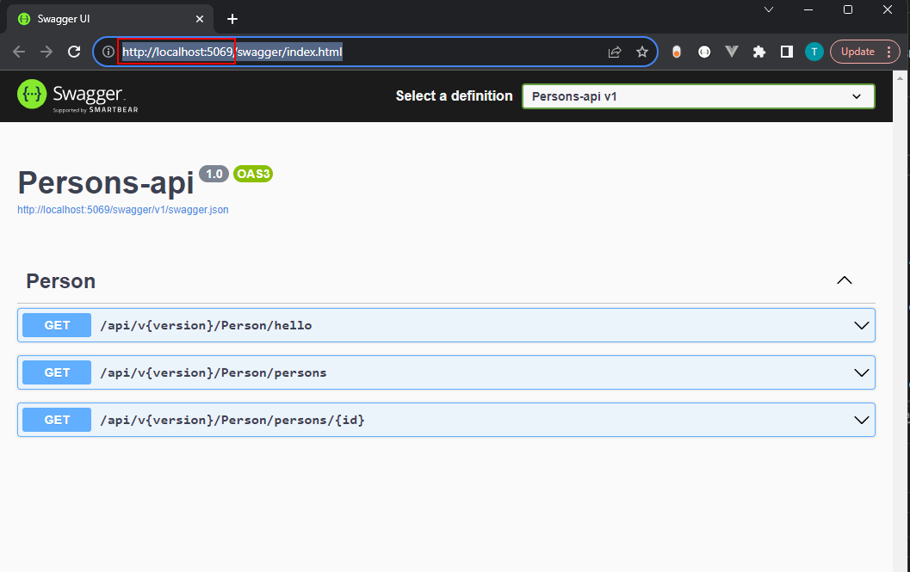

### Running the API Client

1. Navigate to the `Respiri\src\client\Persons-ApiClient\bin\Debug\net6.0` directory.

2. Open the `appsettings.json` file in a text editor.

    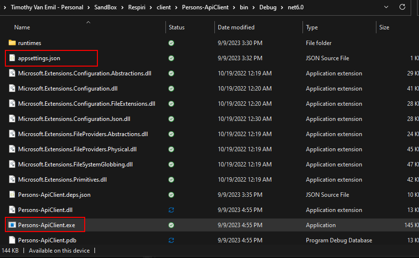

3. Check if the `ApiBaseUrl` is configured correctly in the `appsettings.json` file. Ensure that it matches the base URL of the API server.

    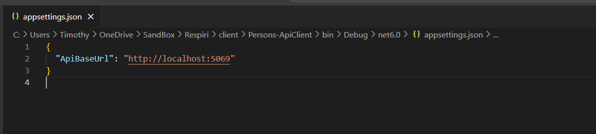

4. Run the `Persons-ApiClient.exe` to start the API Client.

    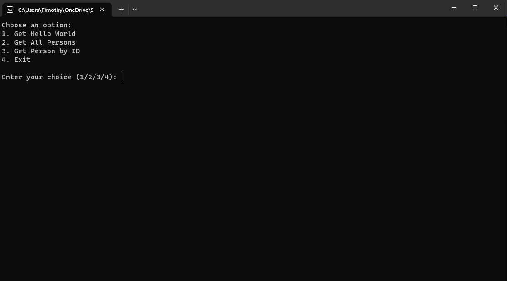

    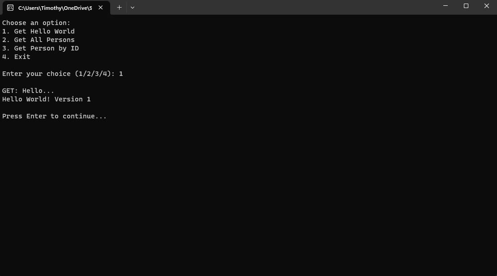

    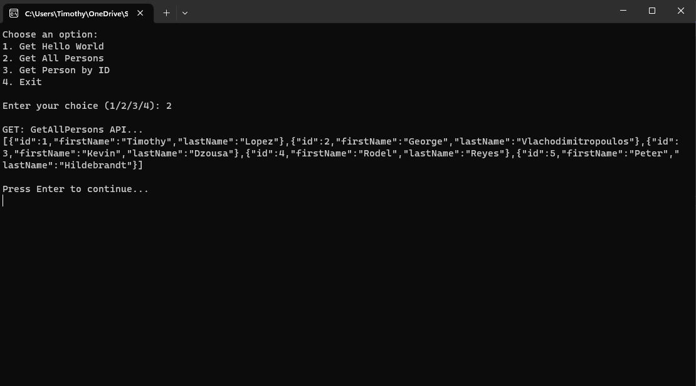

    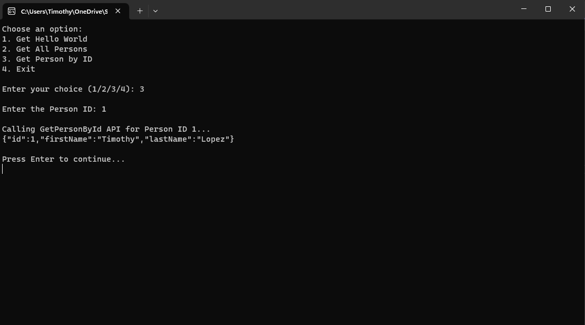

## Features

The Respiri solution is composed of three projects, following the Clean Architecture principles:

- **Persons.Core**: This is a class library that contains entities and core functionalities of the application.

- **Persons.Data**: This class library is responsible for repositories and data access, serving as the infrastructure layer.

- **Persons-api**: This is a .NET Core API project, serving as the presentation layer for the application.

    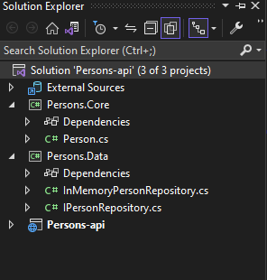

Custom middlewares have been added to the API server for handling custom exceptions and 404 not found errors. This ensures robust error handling and user-friendly responses.

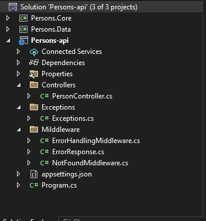

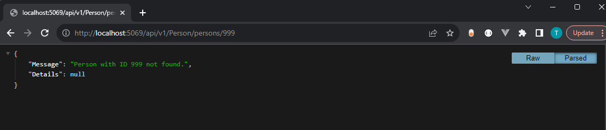

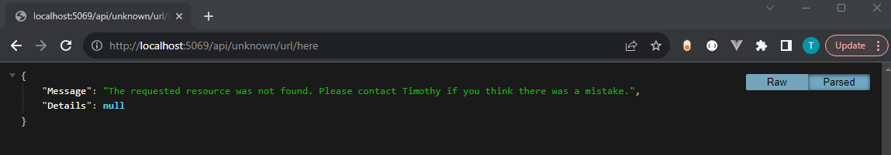

## Contact

If you have any questions, issues, or feedback regarding this project, feel free to contact me:

- **Email**: [timothy812c@gmail.com](mailto:timothy812c@gmail.com)

I welcome your input and look forward to hearing from you!